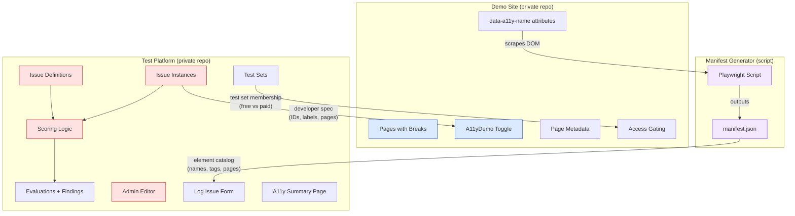
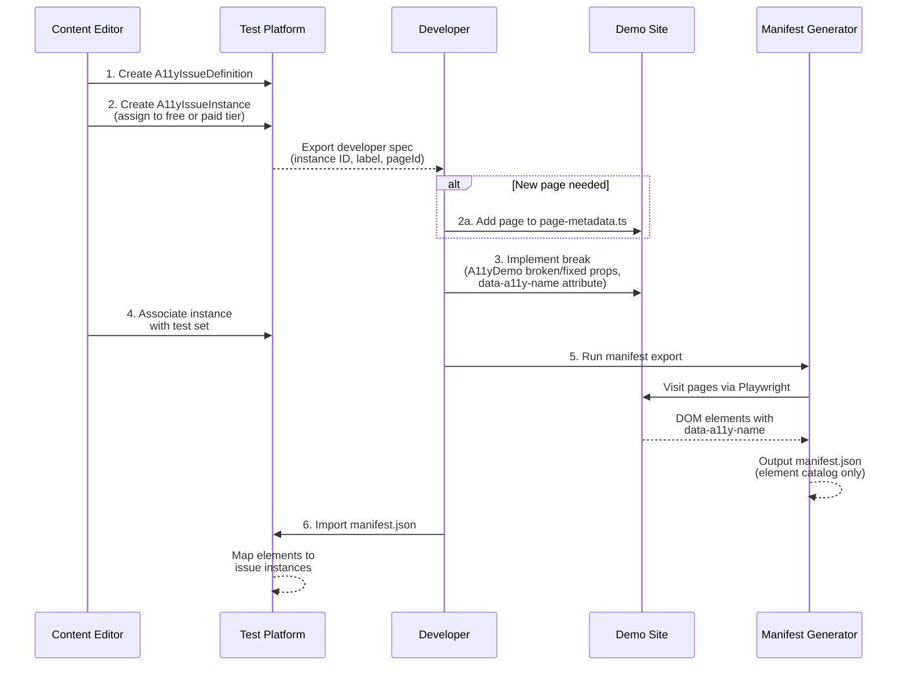
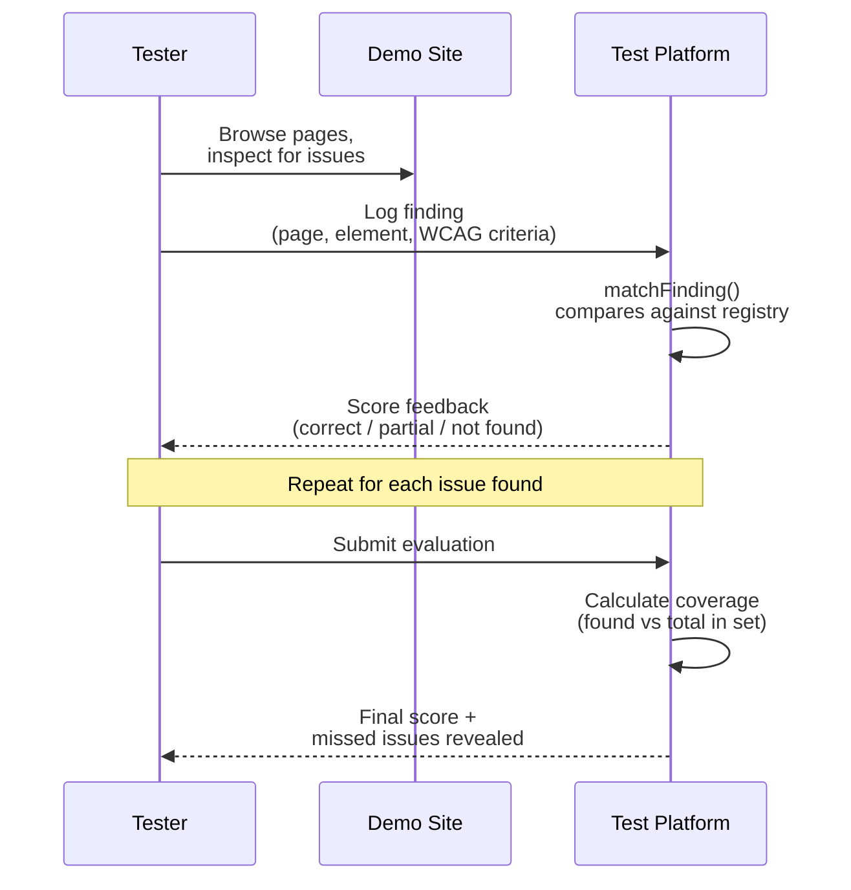
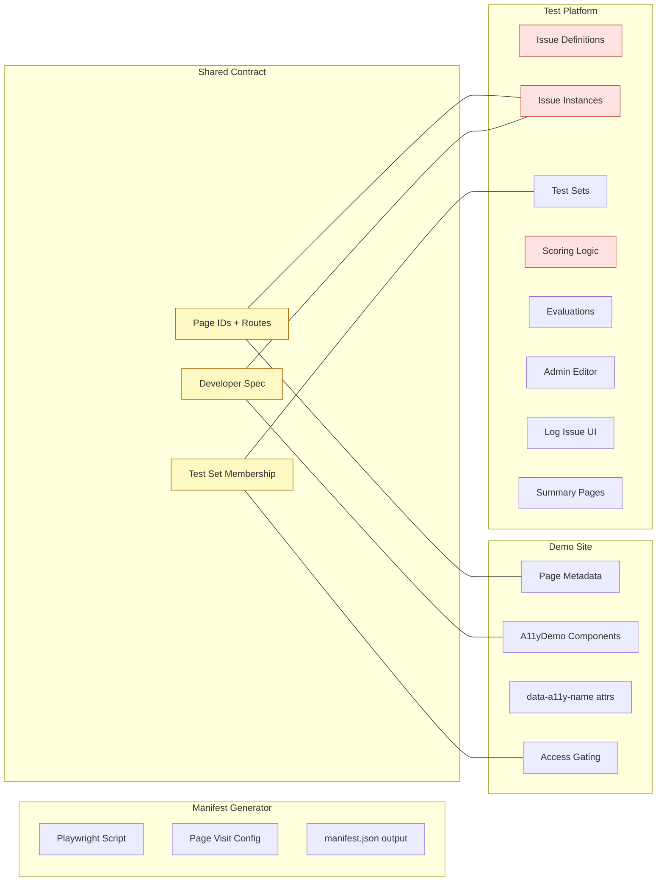
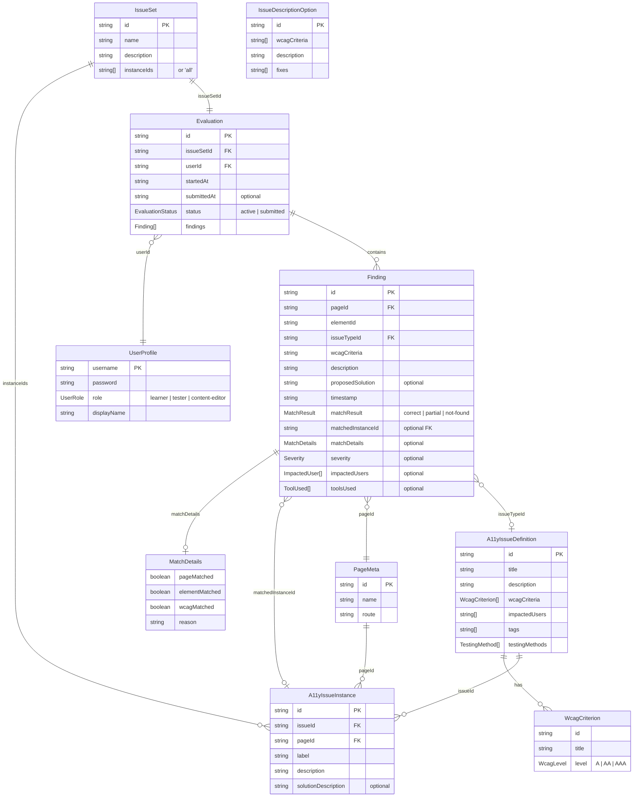

# Data Map: App Separation

This document maps all data artifacts across the three conceptual apps in the project, identifying who creates each piece of data, where it lives, who consumes it, and whether it contains answer key information.

## The three apps

1. **Demo Site** — the example healthcare application that contains intentional accessibility issues for users to find
2. **Test Platform** (separate, private repo) — the site where users log their findings, get scored, and review results. Owns the answer key.
3. **Manifest Generator** — a Playwright script that visits the running Demo Site, scrapes `data-a11y-name` elements from the DOM, and outputs `manifest.json`

Currently all three live in the same repo. The repo must be **private** to protect the answer key. See [Repo visibility and access tiers](#repo-visibility-and-access-tiers).

---

## Workflow: adding a new accessibility issue

Example: "Image is missing an alt tag"

| Step | Action | Who | Where | Notes |
|---|---|---|---|---|
| 1 | **Create an `A11yIssueDefinition`** | Content Editor | Test Platform | `id` maps to instances. `wcagCriteria` from WCAG standard. Other fields populate the log-issue form and scoring. |
| 2 | **Create an `A11yIssueInstance`** | Content Editor | Test Platform | Decides free or paid tier. `pageId` must match `page-metadata.ts` in Demo Site. `issueId` references the definition from step 1. `id` and `label` are shared with developers for step 3. |
| 2a | *(if needed)* **Add a new page to `page-metadata.ts`** | Developer | Demo Site | Only if the instance targets a page that doesn't exist yet. |
| 3 | **Implement the break in the Demo Site** | Developer | Demo Site | Uses `A11yDemo` component with `broken` and `fixed` props — developer writes both markup versions. Adds `data-a11y-name` attribute to the element for manifest scraping. |
| 4 | **Associate the instance with a test set** | Content Editor | Test Platform | Test sets are shared between Demo Site and Test Platform (Demo Site uses them for access gating, Test Platform for evaluation scoping). |
| 5 | **Run the Manifest Generator** | Developer or CI | Manifest Generator | Visits the running Demo Site via Playwright and scrapes all `data-a11y-name` elements. Outputs element names and HTML tags per page — no issue or answer key data. |
| 6 | **Import `manifest.json` into the Test Platform** | Developer or CI | Test Platform | Populates the element dropdown on the log-issue form. Test Platform maps elements to issue instances using its own registry. |

### Developer spec

The Content Editor creates issue instances on the Test Platform before developers implement the breaks. To bridge that handoff without exposing the answer key, the Test Platform can export a lightweight **developer spec** — just the instance IDs, labels, and page targets:

```json
{
  "instances": [
    { "id": "landing-hero-img-alt", "label": "Hero image", "pageId": "landing" },
    { "id": "contact-form-labels", "label": "Name field group", "pageId": "contact" }
  ]
}
```

This tells developers *where* to place breaks and *what to name them*, without revealing the WCAG criteria, issue type, solution, or scoring details. The developer doesn't need to know *what* the issue is — they receive separate implementation instructions for the broken/fixed markup.

### Data flow direction

```
Test Platform --> Demo Site:       developer spec (instance IDs, labels, page targets) + test set membership
Demo Site --> Manifest Generator:  DOM elements with data-a11y-name attributes
Manifest Generator --> Test Platform:  manifest.json (element catalog per page)
```

### What changes about `A11yDemo` after separation

Today, `A11yDemo` accepts `instanceId` and `label` props and registers them with an `ElementRegistry`. The `A11yExportBridge` reads that registry plus the `issues-registry.ts` to build the manifest with break annotations (`hasBreak`, `instanceId`, `issueId`).

After decoupling:

| Concern | Today | After separation |
|---|---|---|
| **`A11yDemo` component** | Toggles broken/fixed, registers with `ElementRegistry` | Toggles broken/fixed only. Registration no longer needed. |
| **`instanceId` prop** | Used by `ElementRegistry` and bridge | Removed or kept as a code comment for developer traceability |
| **`label` prop** | Used by `ElementRegistry`, matched to `data-a11y-name` | No longer needed — `data-a11y-name` on the element itself is sufficient |
| **`ElementRegistry`** | Tracks registered elements for the bridge | Removed from Demo Site |
| **`A11yExportBridge`** | Reads `ElementRegistry` + `issues-registry.ts`, exposes `window.__a11yManifest()` | Removed from Demo Site |
| **`issues-registry.ts`** | Imported in Demo Site (answer key in source code) | Moves entirely to Test Platform |
| **Manifest Generator** | Scrapes DOM + calls `window.__a11yManifest()` for break data | Scrapes DOM `data-a11y-name` only — produces a "dumb" element catalog with no answer key data |
| **`page-elements.ts`** | Hardcoded list of element names per page | Replaced by manifest.json (generated, not hardcoded) |

---

## Data artifacts (current state)

| Data | Contains answers? | Created by | Stored in | Consumed by | Why |
|---|---|---|---|---|---|
| **Issue definitions** (WCAG criteria, descriptions, impact) | YES | Content editor | `issues-registry.ts` (hardcoded) | Test Platform (scoring) | Defines what the known issues are |
| **Issue instances** (which element on which page has which issue) | YES | Content editor | `issues-registry.ts` (hardcoded) | Test Platform (scoring) | Maps issues to specific DOM locations |
| **Page metadata** (page IDs, names, routes) | No | Developer | `page-metadata.ts` | Demo Site (navigation), Test Platform (dropdowns) | Shared vocabulary for pages |
| **Page elements** (element names per page) | No | Developer | `page-elements.ts` | Test Platform (element dropdown in log-issue form) | Lets testers pick which element they found an issue on |
| **Issue sets** (which instances are in scope for an evaluation) | No | Content editor | `issue-sets.json` + localStorage | Test Platform (scoping) | Defines what a "Full Assessment" covers |
| **manifest.json** | YES (currently) | Manifest Generator | Repo root (file) | Currently: nothing consumes it at runtime | After separation: "dumb" element catalog (no answers), consumed by Test Platform |
| **Evaluations + Findings** | No (tester work) | Tester | localStorage (`a11y-road-evaluations`) | Test Platform (scoring, review) | Tester submissions, compared against answer key |
| **Match results** | Partial (reveals correctness) | `matchFinding()` | Finding object in localStorage | Test Platform (feedback UI) | Real-time scoring feedback |
| **Admin editable copies** | YES | Content editor role | localStorage (`a11y-road-admin-*`) | Admin UI | Lets content editors modify the answer key without code changes |
| **`/api/a11y-issues` endpoint** | YES | Server route | Runtime | Currently: reference/learning | Serves the full registry over HTTP |
| **`window.__a11yManifest()`** | YES | `a11y-export-bridge.tsx` | Runtime (global function) | Manifest Generator (Playwright) | Removed after separation — manifest scrapes DOM directly |

---

## Where the answer key leaks today

The core problem: all three apps share the same codebase and the same runtime, so answer key data is accessible to testers in multiple ways:

1. **Source code** — `issues-registry.ts` is right there in the repo
2. **API** — `/api/a11y-issues` serves the full registry, no auth gating
3. **Real-time scoring** — `matchFinding()` gives immediate correct/partial/not-found feedback during testing
4. **Admin localStorage** — editable answer key copies sitting in the browser
5. **Bundle** — the issue definitions and instances ship in the client JS bundle

---

## What belongs where after separation

| App | Owns | Needs from others |
|---|---|---|
| **Demo Site** | Page metadata, `A11yDemo` toggle (broken/fixed), `data-a11y-name` attributes, access gating for paid pages | Test set membership (to know which pages are free vs gated) |
| **Manifest Generator** | `export-manifest.ts`, page visit config | Access to running Demo Site |
| **Test Platform** (private repo) | Issue definitions, issue instances, issue sets, scoring logic (`matchFinding`), evaluations, admin editor, summary page, `/api/a11y-issues` | `manifest.json` (element catalog from Manifest Generator) |

---

## Current file locations

| File | Current location | App it belongs to |
|---|---|---|
| `issues-registry.ts` | `apps/a11y-road/src/data/` | Test Platform |
| `A11yRegistry` class | `libs/a11y-kit/src/registry.ts` | Test Platform |
| `page-metadata.ts` | `apps/a11y-road/src/data/` | Shared (Demo Site + Test Platform) |
| `page-elements.ts` | `apps/a11y-road/src/data/` | Replaced by manifest.json after separation |
| `issue-sets.json` | `apps/a11y-road/src/data/` | Test Platform (shared contract with Demo Site for access gating) |
| `evaluation-types.ts` | `apps/a11y-road/src/data/` | Test Platform |
| `export-manifest.ts` | `apps/a11y-road/scripts/` | Manifest Generator |
| `a11y-export-bridge.tsx` | `apps/a11y-road/src/components/providers/` | Removed after separation |
| `element-registry-provider.tsx` | `libs/a11y-kit/src/components/` | Removed after separation |
| `manifest.json` | Repo root | Manifest Generator (output) --> Test Platform (input) |
| `a11y-summary/` pages | `apps/a11y-road/src/app/.../a11y-summary/` | Test Platform |
| `log-issue/` pages | `apps/a11y-road/src/app/.../log-issue/` | Test Platform |
| `evaluation/` pages | `apps/a11y-road/src/app/.../evaluation/` | Test Platform |
| `/api/a11y-issues` route | `apps/a11y-road/src/app/.../api/a11y-issues/` | Test Platform |
| `issue-logger-provider.tsx` | `apps/a11y-road/src/components/providers/` | Test Platform |
| `admin-data-provider.tsx` | `apps/a11y-road/src/components/providers/` | Test Platform |

---

## Repo visibility and access tiers

The repo must be **private**. There is no way to protect the intentional breaks from users if the source code is public. This is a credibility requirement for the testing platform — if testers can read the answer key, the certification has no value.

### Two access tiers

| Tier | Demo Site | Test Platform |
|---|---|---|
| **Free** | Public pages with a subset of breaks, available to anyone | Free evaluation against the public page set |
| **Paid** | Additional pages/breaks behind authentication | Full evaluation sets, purchased through the Test Platform |

### What this means for shared data

Test sets define which pages and breaks belong to each tier. Both the Demo Site and the Test Platform need to know this:

- **Demo Site** needs to know which pages/breaks are free vs gated, so it can enforce access
- **Test Platform** needs to know the same, so it can scope evaluations and handle purchases

This makes test sets a **shared contract** between the two platforms, not just a Test Platform concern.

### Authentication considerations

Two possible approaches:

1. **Shared authentication** — a single auth system spans both sites. A user who purchases a test set on the Test Platform is automatically granted access to the corresponding Demo Site pages. Simpler UX, but tighter coupling.
2. **Token-based access** — the Test Platform issues a token (or unlock code) when a user purchases a test set. The user presents this token to the Demo Site to access gated pages. Looser coupling, but adds a redemption step.

Open questions:
- Does purchasing happen on the Test Platform, and if so, does the Demo Site need to validate that purchase in real time?
- Should free-tier users need to create an account, or is the free tier truly anonymous?
- How are test sets versioned if the Demo Site pages change over time?

---

## Diagrams

### System overview: three apps and their boundaries



Red = answer key data, Blue = demo site, Purple = manifest generator

### Workflow: adding a new issue (sequence)



### Data flow: tester evaluation



### Data ownership: what lives where



Red = answer key, Yellow = shared contracts between apps

### Entity relationship map



> **Manifest (manifest.json):** A generated artifact, not a core entity. A Playwright script visits the running Demo Site, scrapes all `data-a11y-name` elements, and outputs an element catalog keyed by `PageMeta.id`. Currently includes break annotations linking back to `A11yIssueInstance` and `A11yIssueDefinition` — after separation, these links are removed and the manifest becomes a "dumb" element list consumed by the Test Platform's log-issue form. See [ExportManifest types](#data-artifacts-current-state) and the [system overview diagram](#system-overview-three-apps-and-their-boundaries) for details.

**Key relationships:**

- **A11yIssueDefinition → A11yIssueInstance** — one definition (e.g. "missing alt text") can have many instances across different pages/elements
- **PageMeta → A11yIssueInstance** — each instance is placed on a specific page via `pageId`
- **IssueSet → A11yIssueInstance** — a test set scopes which instances are in play for an evaluation (can use `"all"`)
- **Evaluation → Finding** — a tester's evaluation session contains multiple findings
- **Finding → A11yIssueInstance** — scoring (`matchFinding()`) links a finding back to the expected instance via `matchedInstanceId`
